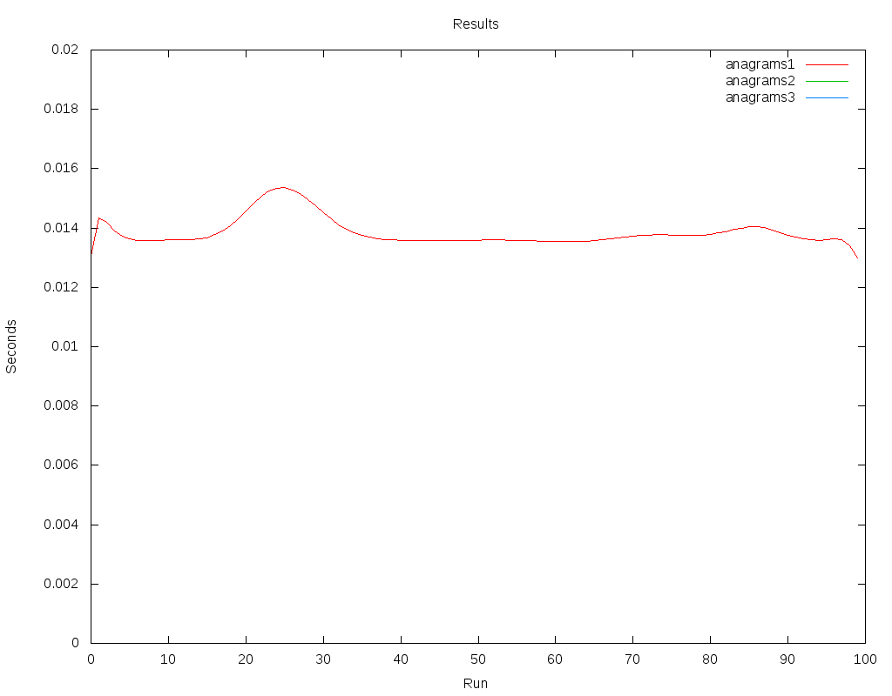
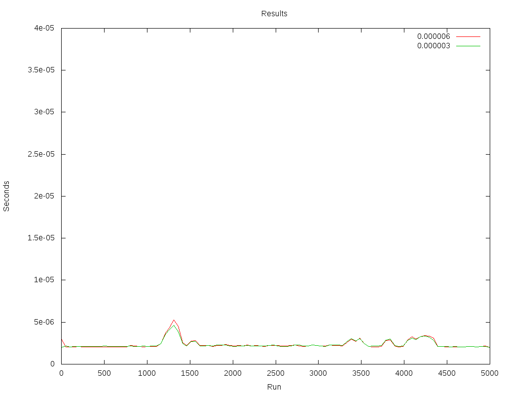

Anagrams
========

The problem
------------

Given a words.txt file containing a newline-delimited list of dictionary
words, please implement the Anagrams class so that the get_anagrams() method
returns all anagrams from words.txt for a given word.

**Bonus requirements:**

  - Optimise the code for fast retrieval
  - Write more tests
  - Thread safe implementation

General approach
----------------

*"An anagram is direct word switch or word play, the result of rearranging
the letters of a word or phrase to produce a new word or phrase, using
all the original letters exactly once"* ( source: wikipedia )

That means that in order to get all the anagrams for a needed word, we don't
need to compare the words theirselves but their ordered representation.

Given two words, word1 and word2

If the ordered characters of word1 are the same that the ordered characters
of word2,

Then

word1 and word2 are anagrams.

Assumtions
----------

- One given word is anagram of itself.
- Anagrams are **not** case sensitive so "Star" is an anagram of "Tras".
- Special caracters as " ' " are considered as regular caracters too.

.. page::

Solutions
---------

There is a few options to approach this problem, and this document goes through
some of them, from the one which could come first to an inexperienced
developer's head to a couple of them with important improvements.

Well see that the first approach, wich implements the trivial solution, has
am awful performance, while the second and third one performs thousands of times
better with a cost of some extra memory use.

Solution 1
..........

This approach collects all the words in the dictionary and stores them in a list.
In order to find the anagrams for a given word, the algorithm needs
to sort each of the words in the dictionary to compare them to the
sorted given word.

The building of the list is very fast, as no operation involved.
However, further searchs are very slow due to the dictionary needs to be
complely walked in order to find anagrams.

.. code-block:: python
  :startinline: true
  :linenos: true
  :linenos_offset: true
  :include: anagrams/anagrams.py
  :start-after: # rst-Anagrams1
  :end-before: # rst-Anagrams2

.. page::

Solution 2
..........

In this solution, a python dictionary is created in order to store a pair
keys - values, where key is the ordered characters representation of each
word in the original dictionary and value is a list containing all the words
in the original dictionary where their ordered characters representation is
the same that the key.

In this case, collecting the words from the original words dictionary is
slightly slower and it requires extra memory ( more or less twice, actually )
but the performance later on, getting the anagrams for a given word is
much better as only indexing the characters ordered representation of the
given word will return all its anagrams.

.. code-block:: python
  :startinline: true
  :linenos: true
  :linenos_offset: true
  :include: anagrams/anagrams.py
  :start-after: # rst-Anagrams2
  :end-before: # rst-Anagrams3

.. page::

Solution 3
..........

Similarly to solution 2, buils a python dictionary where the key is the
hash of the ordered characters representation for each of the original words
and value is a list containing all words where the hash of their ordered
characters representation matches the key.

This one should be the best approach in performance and the extra memory
used for the keys is fixed to *size of integer* * number of words.

.. code-block:: python
  :startinline: true
  :linenos: true
  :linenos_offset: true
  :include: anagrams/anagrams.py
  :start-after: # rst-Anagrams3
  :end-before: # rst-Tests

Results
-------

Solution 1, as expected, has a very bad performance.

Running each of the aproaches 500 times, Solution 1 is between 5000 and 8000
times slower than Solution 2 and Solution 3

========== ============== ============= ===============
ta/tb          Solution 1    Solution 2      Solution 3
========== ============== ============= ===============
Solution1                   7763.218794     7645.291891
Solution2                                      0.984810
========== ============== ============= ===============

Solution 2 and Solution 3 are almonst the same, being Solution 2 slightly 
faster than Solution 3 ( probably because of the cost of hash ).

Solution 3 is, however, less memory consumming.

.. page::

Figure 1 representes the times for the three solutions. Huge difference between 
Solution 1 and Solutions 2 and 3 prevent the latter to be visible.

    Fig. :counter:`figure`: 50 ran times, solutions 1, 2 and 3

.. page::

Figure 2 represents times for solutions 2 and 3. Both solutions present
a very similar performance.

    Fig. :counter:`figure`: 5000 ran times, solutions 2 and 3

.. page::

Having a look to these results, the election of Solution 2 or Solution 3
would depend on which is more important in a real proyect:

* Is it critical to be as fast as possible and to use more memory is
  not a big deal ? 

  Solution 2 wins.

* Is it critical to save memory and having a slighty slower algorithm is
  suitable ?

  Solution 3 wins.

Latest considerations
---------------------

* About tests

  An exhaustive test is ran covering 100% of the words in the given dictionary

* About threading

  All solutions are thread safe

* About performance

  Solutions 2 and 3 have a very good performance.

Test environment
----------------

* Intel(R) Core(TM) i5-5300U CPU @ 2.30GHz.
* Linux Mint 17
* Python 2.7.6

